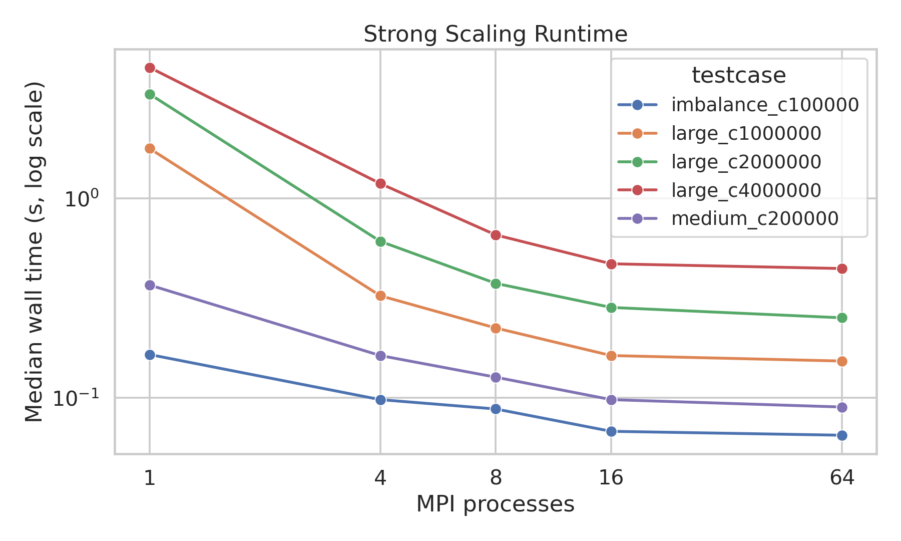
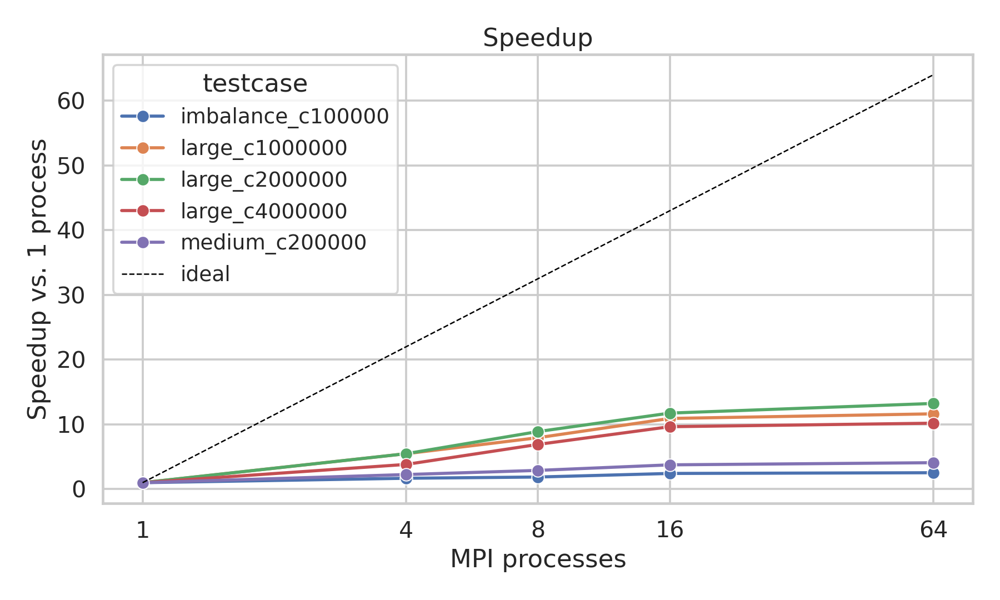
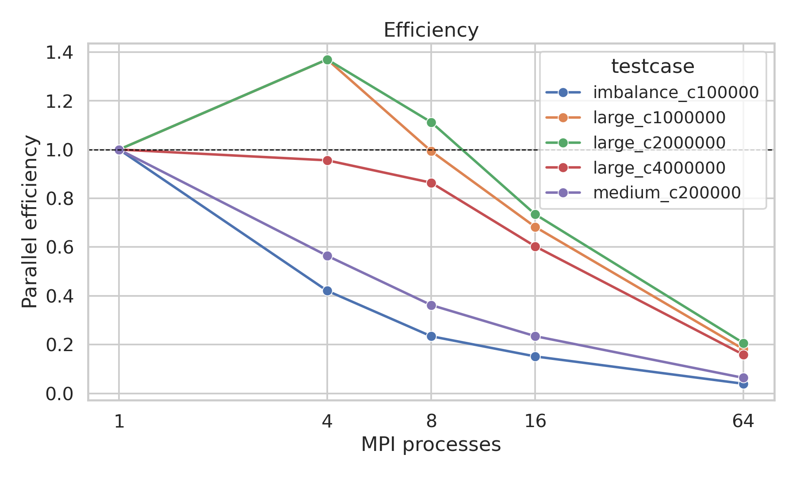
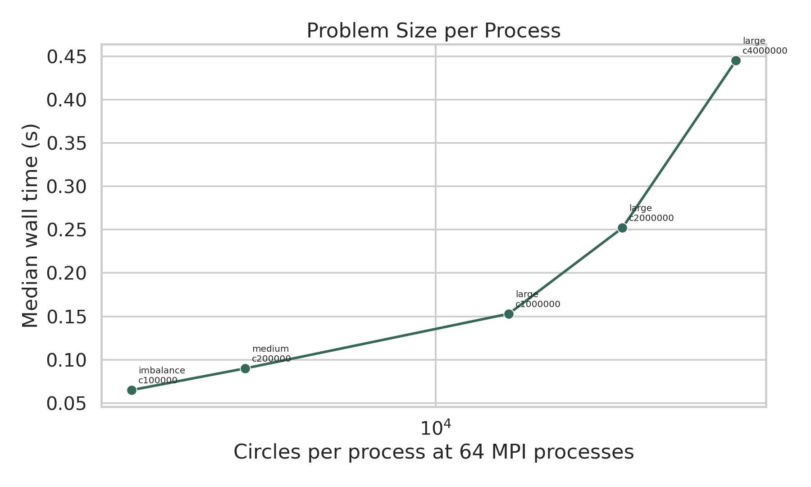
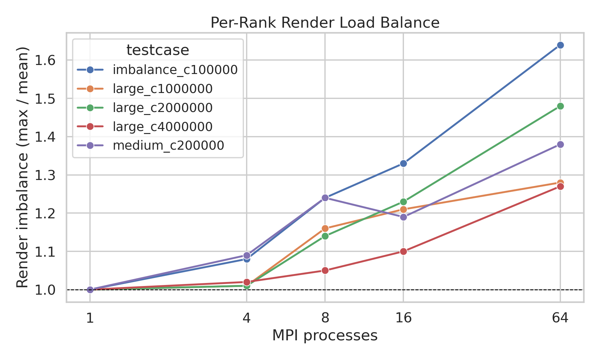

# HW3 MPI Circle Renderer Report

## Summary

This project implements the required CRDR circle renderer in `renderer.c` and the optimized MPI implementation in `renderer_mpi.c`. The final MPI renderer preserves the file order semantics specified in `spec.pdf`: circles are stored back-to-front, so rendering records in input order lets later circles overwrite earlier circles exactly.

All benchmarked outputs were byte-identical to the provided golden PNG files. The benchmark data used in this report were generated with:

```bash
REPS=10 NPROCS="1 4 8 16 64" ./bench.sh
poetry run python scripts/generate_report_assets.py
```

The generated data and figures are stored in:

- `data/testcase_metadata.csv`
- `data/benchmark_results.csv`
- `data/summary_16proc.csv`
- `data/summary_64proc.csv`
- `figure/strong_scaling_runtime.png`
- `figure/speedup.png`
- `figure/efficiency.png`
- `figure/imbalance.png`
- `figure/problem_size_per_process.png`

## Environment

- OS: Ubuntu 24.04.1 LTS, Linux kernel 6.8.0-100-generic
- CPU: Intel(R) Xeon(R) Platinum 8352V CPU @ 2.10GHz
- Topology: 2 sockets, 36 cores/socket, 2 threads/core, 2 NUMA nodes
- MPI runtime: Open MPI 4.1.6
- Compiler: `mpicc` using GCC 13.3.0

### Experiment Settings

- Build command: `mpicc renderer_mpi.c -o renderer_mpi -lm -march=native`
- Process counts tested: 1, 4, 8, 16, 64
- Single-node runs use up to 16 MPI processes.
- The 64-process run uses 4 nodes with 16 processes per node through the `hosts` hostfile.
- Each point reports the median of 10 runs.
- Reported times are the total wall times printed by `renderer_mpi`, including MPI communication and image output.

## Implementation

The final MPI renderer selects between two strategies at runtime based on the circle count. Scenes with 500,000 or fewer circles use **Mode A (REPLICATE)**; scenes above that threshold use **Mode B (PARTITION)**. The threshold was tuned empirically against benchmark data at 64 processes and can be overridden via the `RENDERER_THRESHOLD` environment variable.

### Mode A: REPLICATE (cyclic row decomposition)

Rank 0 reads the CRDR file and broadcasts all circle records to every rank. Each rank owns a cyclic stripe of image rows: rank `r` owns rows `r, r+P, r+2P, ...`, where `P` is the number of processes. Before rasterizing, each rank prefilters the full record list to retain only circles whose bounding-box y-range intersects its owned rows; the prefiltered list caches the bounding box and the first owned row (`y_first`) so the inner raster loop is branch-free with respect to ownership. Each rank rasterizes into a compact `W × local_rows` RGB buffer. At the end, `MPI_Gatherv` collects compact slices and rank 0 re-interleaves them into the final image.

Cyclic row ownership spreads work evenly across ranks even when circles cluster in one vertical region, which a contiguous block assignment cannot guarantee. The compact per-rank buffer avoids allocating a full `W × H` image on every process, which matters when P is large.

### Mode B: PARTITION (record partitioning with painter reduce)

Rank 0 reads and broadcasts the full record array (Scatterv was measured to be approximately 3x slower than Bcast on this cluster for equivalent payloads, so Bcast is used in both modes). Each rank then slices the record array locally: rank `r` owns a contiguous chunk of `count/P` consecutive records in file order, with rank 0 holding the earliest (back-most) circles and rank `P-1` holding the latest (front-most) circles. Each rank rasterizes its own records into a full `W × H` buffer of `uint32` encoded pixels, where each pixel is packed as `((rank+1) << 24 | R << 16 | G << 8 | B)`. Untouched pixels remain zero. `MPI_Reduce` with `MPI_MAX` across all ranks then selects the correct color per pixel: a higher rank marker means a circle drawn later (closer to the front) wins, exactly matching the back-to-front painter semantics. Using a predefined `MPI_MAX` operation on `MPI_UINT32_T` instead of a custom non-commutative `MPI_Op` keeps the reduction on the hardware-accelerated collective path.

This mode reduces per-rank rasterization cost to approximately `1/P` of the serial work, at the cost of a `W × H × 4` byte full-image buffer on each rank and a reduction across all pixels.

### Common optimizations

- Per-row analytic x-range trimming using `sqrtf`, followed by the exact circle-inside test, avoids iterating over pixels clearly outside the circle.
- Direct opaque RGB writes match the assignment format where records contain only `uint8 r, g, b` with no alpha.
- In-source `#pragma GCC optimize("O3", "unroll-loops")` because the official compile command uses no explicit `-O` flag.

## Test Cases

The binary metadata in `data/testcase_metadata.csv` shows that the large cases use a 640x480 image with 1M, 2M, and 4M circles. The special `imbalance_c100000` case is smaller, 320x240 with 100K circles, but has much larger radius variation: max radius is about 1998 pixels, compared with about 20 pixels for the regular large cases. This explains why it is useful for load-balance stress testing.

| Testcase | Circles | Image | Mean radius | Max radius |
|---|---:|---:|---:|---:|
| `imbalance_c100000` | 100,000 | 320x240 | 25.62 | 1998.10 |
| `medium_c200000` | 200,000 | 640x480 | 10.49 | 20.00 |
| `large_c1000000` | 1,000,000 | 640x480 | 10.50 | 20.00 |
| `large_c2000000` | 2,000,000 | 640x480 | 10.50 | 20.00 |
| `large_c4000000` | 4,000,000 | 640x480 | 10.50 | 20.00 |

## Benchmark Results

The benchmark uses the median wall time across 10 repetitions for each `(testcase, process count)` pair. The one-process MPI run is used as the serial baseline for speedup and efficiency because it exercises the same optimized renderer with `P=1`.





| Testcase | 1 proc (s) | 4 proc (s) | 8 proc (s) | 16 proc (s) | 64 proc (s) | 64-proc speedup | 64-proc efficiency |
|---|---:|---:|---:|---:|---:|---:|---:|
| `imbalance_c100000` | 0.165 | 0.098 | 0.088 | 0.068 | 0.065 | 2.54x | 4.0% |
| `medium_c200000` | 0.368 | 0.163 | 0.127 | 0.098 | 0.090 | 4.09x | 6.4% |
| `large_c1000000` | 1.780 | 0.325 | 0.224 | 0.163 | 0.153 | 11.63x | 18.2% |
| `large_c2000000` | 3.336 | 0.609 | 0.375 | 0.284 | 0.252 | 13.24x | 20.7% |
| `large_c4000000` | 4.534 | 1.186 | 0.656 | 0.470 | 0.445 | 10.19x | 15.9% |

The best 64-process strong-scaling result is `large_c2000000`, which improves from 3.336 s on one process to 0.252 s on 64 processes, a 13.24x speedup. On a single local node, the same case improves to 0.284 s on 16 processes, an 11.75x speedup with 73.4% efficiency. The smaller cases still improve, but their efficiency drops because fixed costs such as record broadcast, gather, PNG writing, MPI launch overhead, and multi-node communication become a larger fraction of total runtime.



## Problem Size Per Process

At 64 processes, throughput increases with larger scenes: 1.54 million circles/s for `imbalance_c100000`, 2.22 million circles/s for `medium_c200000`, 6.54 million circles/s for `large_c1000000`, 7.94 million circles/s for `large_c2000000`, and 8.99 million circles/s for `large_c4000000`. This is shown in `data/summary_64proc.csv` and `figure/problem_size_per_process.png`.



The weak-scaling conclusion is mixed. More circles per process amortize fixed MPI and output costs, so throughput improves as the problem gets larger. However, wall time still grows from 0.153 s at 1M circles to 0.445 s at 4M circles on 64 processes because each process still loops over every circle and only skips pixels outside its owned rows. The algorithm scales well enough for strong scaling, but it is not true weak scaling because broadcast size and per-rank circle iteration both grow with total circle count.

## Load Balance

`renderer_mpi.c` logs per-rank render time statistics and reports imbalance as `max / mean`. The measured imbalance values are in `data/benchmark_results.csv` and plotted below.



The three large scenes (`large_c1000000`, `large_c2000000`, `large_c4000000`) use Mode B (PARTITION). In this mode each rank renders a disjoint slice of records into a full image, so imbalance reflects circle-count variance across ranks. Since records are split evenly, imbalance arises from radius variation rather than spatial clustering. At 16 processes the imbalance is 1.21, 1.23, and 1.10 respectively; at 64 processes it is 1.28, 1.48, and 1.27. The values are controlled because the large scenes use uniformly sized circles (max radius 20 pixels).

The two smaller scenes (`imbalance_c100000`, `medium_c200000`) use Mode A (REPLICATE). In this mode each rank rasterizes prefiltered circles into its cyclic row stripe, so imbalance reflects whether very large circles disproportionately cover certain rows. At 64 processes, `medium_c200000` has imbalance 1.38 and the `imbalance_c100000` case has the highest imbalance at 1.64. The special imbalance case contains circles with radii up to 1998 pixels in a 320x240 image, meaning a single circle can span almost the full image height. Cyclic row distribution spreads that coverage across all ranks rather than concentrating it in one contiguous block, which is why imbalance stays below 2x despite the extreme radius variation. Even with this imbalance, wall time still improves from 0.165 s at one process to 0.065 s at 64 processes.

## Conclusion

The MPI renderer is correct on all benchmarked test cases and shows useful strong scaling through the 64-process competition configuration. The adaptive strategy, switching from cyclic row decomposition (Mode A) at smaller scene sizes to record partitioning with a painter reduce (Mode B) at larger scene sizes, gives good scaling across both regimes. The best measured result is 13.24x speedup on `large_c2000000` (Mode B); the 4M-circle case reaches the highest throughput at 8.99 million circles/s.

The main cost in Mode A is that every rank scans all records during prefiltering, so broadcast size and prefilter time grow with total circle count regardless of P. Mode B addresses this by giving each rank only count/P records to rasterize, but trades it for a full-image `uint32` buffer per rank and a pixel-level `MPI_MAX` reduction. The threshold of 500,000 circles was chosen where the reduction overhead in Mode B becomes cheaper than the per-rank prefilter scan cost in Mode A at 64 processes.
